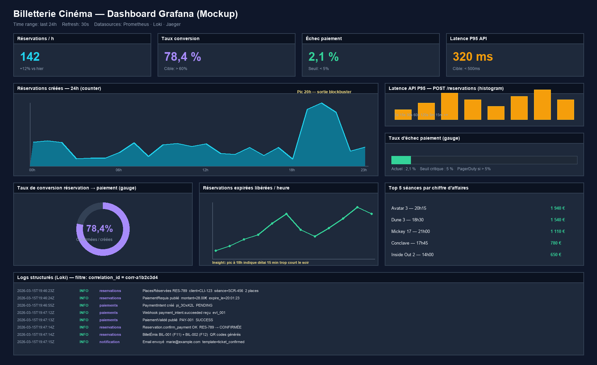

# Dashboard Grafana — Maquette d'observabilité

> Chapitre 6 — Livrable 3 : Maquette du dashboard de monitoring du système.
> **Image principale** : [`dashboard-grafana.png`](dashboard-grafana.png)

---

## Annotation des panneaux

### Bandeau supérieur — KPIs (4 tuiles)

| Panneau | Métrique | Type | Valeur cible |
|---------|----------|------|---------------|
| **Réservations / h** | `reservations_created_per_hour` | counter | Variable selon l'heure |
| **Taux de conversion** | `reservations_confirmed / reservations_created × 100` | gauge | > 60 % |
| **Échec paiement** | `payments_failure_rate` | gauge | < 5 % (PagerDuty au-delà) |
| **Latence P95 API** | `http_request_duration_seconds{p95}` | histogram | < 500 ms |

### Panneau central — Réservations sur 24h

- **Type** : courbe temporelle (counter agrégé par heure)
- **Source** : Prometheus
- **Annotation** : pic à 20h correspondant aux séances du soir d'un blockbuster (ex. Avatar 3)
- **Insight métier** : permet de détecter une chute brutale (incident technique probable)

### Bandeau droit — Latence + Échec paiement

- **Latence histogram** : 8 buckets (5s, 15s, 30s, 1m, 2m, 5m, 15m, +∞) — visualise la distribution de la latence de l'endpoint `POST /reservations`
- **Échec paiement gauge** : barre horizontale avec seuil critique. Au-delà de 5 %, alerte PagerDuty automatique (incident Stripe potentiel)

### Bandeau bas-gauche — Taux de conversion (donut)

- **Cible** : 78,4 % observé (au-dessus du seuil de 60 %)
- **Calcul** : sur fenêtre glissante d'1 heure
- **Insight** : un taux faible indique un problème UX dans le tunnel ou des défauts Stripe

### Bandeau bas-centre — Réservations expirées libérées / heure

- **Type** : courbe temporelle (counter)
- **Insight clé** : un pic vers 18h pourrait indiquer que le délai de 15 min est trop court le soir (les clients prennent plus de temps après leur journée de travail)

### Bandeau bas-droit — Top 5 séances par chiffre d'affaires

- **Métrique métier** : `reservation_revenue_total{seance_id}`
- **Utilité** : aide le Gestionnaire à identifier les séances les plus rentables et à optimiser la programmation

### Bandeau inférieur — Logs structurés (Loki)

- **Filtre actif** : `correlation_id = corr-a1b2c3d4`
- **Démontre** : la propagation du Correlation ID à travers les services Réservations, Paiements et Notification, permettant la reconstitution du parcours complet de Marie sur 1,5 seconde de logs

---

## Synthèse des métriques exposées sur `/metrics`

| Métrique | Type | Bounded Context | Seuil d'alerte |
|----------|------|------------------|----------------|
| `reservations_created_per_hour` | counter | Réservations | < 5/h en peak hour → incident |
| `reservations_conversion_rate` | gauge | Réservations | < 60 % → alerte Slack |
| `payments_failure_rate` | gauge | Paiements | > 5 % → PagerDuty |
| `reservation_confirmation_latency_seconds` | histogram | Réservations | P95 > 30s → alerte |
| `expired_reservations_released_per_hour` | counter | Réservations | > 40 % du créé → revoir UX |
| `http_request_duration_seconds` | histogram | Tous services | P95 > 500ms → alerte |

> Voir `observability.md` pour la définition complète et le format de log structuré.
