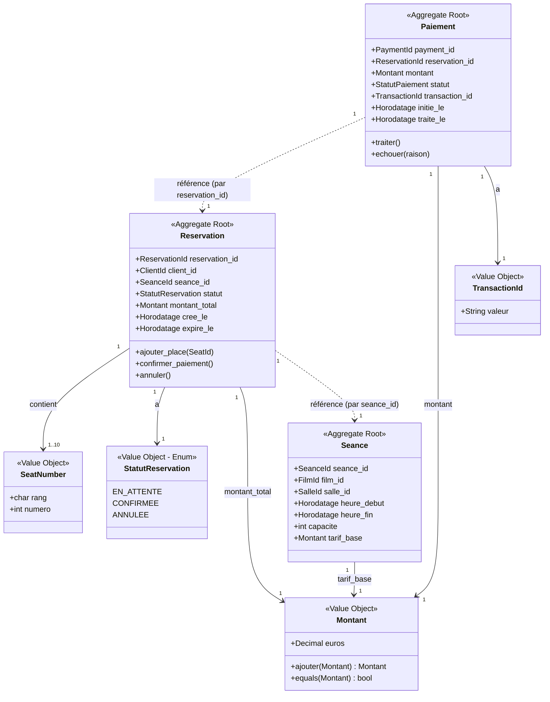

# Modèle de domaine — Billetterie Cinéma

> Chapitre 3 — Livrable 1 : Modèle conceptuel des entités, objets valeur et de leurs relations.
> **100 % conceptuel — aucun code applicatif.**

---

## Entités

| Entité | Description métier (3–5 phrases) | Identifiant métier |
|--------|----------------------------------|--------------------|
| **Réservation** | L'engagement formel d'un client sur un ensemble de sièges pour une séance donnée. Elle suit un cycle de vie strict (EN_ATTENTE, CONFIRMÉE, ANNULÉE) et expire automatiquement si le paiement n'est pas finalisé dans les 15 minutes. Une réservation confirmée ne peut plus être modifiée — seulement annulée. C'est l'agrégat racine du ContexteRéservation : il orchestre la cohérence des sièges, du montant et du paiement associé. | `ReservationId` (UUID, format `RES-789`) |
| **Séance** | Une instance de projection d'un film à une date et heure précises dans une salle déterminée. Elle est caractérisée par sa capacité totale, son tarif de base, et le nombre de places disponibles à l'instant T. Une séance ne peut pas être planifiée dans une salle déjà occupée sur le même créneau (avec 20 min de marge pour le nettoyage). C'est l'agrégat racine du ContexteCatalogue. | `SeanceId` (UUID, format `SCR-456`) |
| **Paiement** | La transaction financière associée à une réservation, traitée via un prestataire externe (Stripe). Elle enregistre le montant débité, le statut (PENDING / SUCCESS / FAILED / REFUNDED), la référence de transaction bancaire et les horodatages. Un paiement ne peut être créé que si la réservation correspondante existe et est encore EN_ATTENTE. En cas d'échec, il déclenche la libération automatique des sièges via un événement `PaiementÉchoué`. | `PaymentId` (UUID, format `PAY-001`) |

---

## Objets valeur

| Objet Valeur | Description métier (2–4 phrases) | Propriétés principales | Justification de l'immuabilité |
|--------------|----------------------------------|--------------------------|----------------------------------|
| **Montant** | Représente une valeur monétaire en euros, toujours arrondie à deux décimales et toujours positive ou nulle. Toute opération arithmétique (somme, comparaison) renvoie un nouvel objet Montant — l'original n'est jamais modifié. Garantit la cohérence financière sur l'ensemble du parcours (calcul de panier, paiement, remboursement). | `euros: Decimal(2)` ≥ 0 | Un montant n'a pas d'identité propre : deux montants de 11,50€ sont parfaitement interchangeables. Modifier un montant existant n'a aucun sens métier (si le tarif change, on calcule un *nouveau* montant) et créerait des incohérences sur les calculs déjà effectués. |
| **SeatNumber** | Identifie la position physique d'un siège dans une salle par son rang (lettre) et son numéro (entier). Une fois créé, il ne peut pas changer car il représente une réalité physique fixe. Deux SeatNumber identiques (même rang, même numéro) sont parfaitement équivalents. | `rang: Char ∈ [A-Z]` ; `numero: int ≥ 1` | Un siège F12 reste F12 dans toute la durée de vie de la salle. On ne « modifie » pas un SeatNumber : on remplace la place par une autre. L'immuabilité empêche tout glissement accidentel d'une réservation vers un autre siège après création. |
| **StatutRéservation** | Énumération à trois valeurs représentant l'état du cycle de vie d'une réservation : `EN_ATTENTE`, `CONFIRMÉE`, `ANNULÉE`. Un changement de statut crée toujours un nouveau VO ; on ne mute jamais l'instance existante. | `valeur ∈ { EN_ATTENTE, CONFIRMÉE, ANNULÉE }` | Le statut est un fait métier figé à un instant donné. Permettre la mutation reviendrait à réécrire l'histoire de la réservation. L'immuabilité simplifie la traçabilité (chaque transition est un événement, pas une mutation silencieuse). |
| **TransactionId** *(bonus)* | Identifiant unique fourni par Stripe pour chaque PaymentIntent. Une fois reçu, il est figé et sert de clé étrangère opaque vers le système externe. | `valeur: String` (format `pi_3OxK2L...`) | C'est un fait externe immuable. Le modifier dans notre modèle créerait une dérive entre notre référentiel et celui de Stripe, rendant la réconciliation comptable impossible. |

---

## Diagramme UML conceptuel

### Version Mermaid (rendu automatique sur GitHub / GitLab)



### Version ASCII (fallback)

```
╔══════════════════════════════════════════════════════════════════╗
║                  MODÈLE DE DOMAINE — VUE CONCEPTUELLE             ║
╚══════════════════════════════════════════════════════════════════╝

                ┌──────────────────────────┐
                │       Séance             │ <Aggregate Root>
                │  (ContexteCatalogue)     │
                ├──────────────────────────┤
                │ + seance_id              │
                │ + film_id                │
                │ + salle_id               │
                │ + heure_debut            │
                │ + capacite               │
                │ + tarif_base : Montant   │
                └────────────┬─────────────┘
                             │ référencée par
                             ▼
        ┌──────────────────────────────────────────┐
        │            Réservation                    │ <Aggregate Root>
        │         (ContexteRéservation)             │
        ├──────────────────────────────────────────┤
        │ + reservation_id                          │
        │ + client_id                               │
        │ + seance_id                               │
        │ + statut : StatutRéservation              │
        │ + montant_total : Montant                 │
        │ + cree_le, expire_le                      │
        ├──────────────────────────────────────────┤
        │ contient 1..10 SeatNumber (VO)            │
        └────────────────────┬─────────────────────┘
                             │ référencée par
                             ▼
        ┌──────────────────────────────────────────┐
        │            Paiement                       │ <Aggregate Root>
        │         (ContextePaiement)                │
        ├──────────────────────────────────────────┤
        │ + payment_id                              │
        │ + reservation_id                          │
        │ + montant : Montant                       │
        │ + statut : StatutPaiement                 │
        │ + transaction_id : TransactionId          │
        └──────────────────────────────────────────┘

╔══════════════════════════════════════════════════════════════════╗
║                       OBJETS VALEUR                               ║
╠══════════════════════════════════════════════════════════════════╣
║   Montant            : { euros: Decimal(2)  ≥ 0 }                 ║
║   SeatNumber         : { rang: Char,  numero: int }               ║
║   StatutRéservation  : ENUM(EN_ATTENTE, CONFIRMÉE, ANNULÉE)       ║
║   StatutPaiement     : ENUM(PENDING, SUCCESS, FAILED, REFUNDED)   ║
║   TransactionId      : { valeur: String (Stripe)  }               ║
╚══════════════════════════════════════════════════════════════════╝
```

> Une version PNG du même diagramme est disponible dans `images/domain-model.png`.

---

## Relations entre entités et frontières d'agrégat

| Relation | Type | Direction | Commentaire |
|----------|------|-----------|--------------|
| Réservation → Séance | Référence par identifiant (cross-aggregate) | Réservation tient `seance_id` | Pas de navigation directe : on passe par le repository côté Catalogue (ACL). |
| Réservation → SeatNumber | Composition (intra-aggregate) | Réservation contient ses places | Les places vivent dans l'agrégat Réservation et sont supprimées avec lui. |
| Paiement → Réservation | Référence par identifiant (cross-aggregate) | Paiement tient `reservation_id` | Permet la réconciliation sans coupler les deux agrégats. |
| Paiement → Montant | Composition | Paiement a un Montant | VO immuable, toujours remplacé jamais muté. |

**Règle clé DDD** : entre deux agrégats différents, on ne référence jamais une instance directe — toujours par identifiant. Cela évite le couplage transactionnel et permet à chaque agrégat de garder ses propres invariants.

---

## Récapitulatif

- **3 entités** : Réservation, Séance, Paiement (toutes racines d'agrégat).
- **3 objets valeur principaux** : Montant, SeatNumber, StatutRéservation (+ TransactionId, StatutPaiement en bonus).
- **2 agrégats détaillés** dans `invariants.md` : Réservation et Paiement.
- **Tous les invariants associés** sont validés par les scénarios Given/When/Then dans `tests-domaine.md`.
