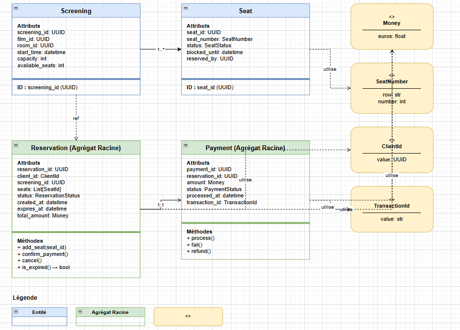

# Modèle de domaine

## Entités

| Entité | Description métier (3–5 phrases) | Identifiant métier |
|--------|----------------------------------|-------------------|
| **Seat** | Un siège physique dans une salle de cinéma, identifié par son rang et son numéro. Il possède un cycle de vie (libre, bloqué, réservé, occupé) qui évolue au fil des réservations. Un siège bloqué est temporairement indisponible pendant qu'un client finalise son achat. Il ne peut être assigné qu'à une seule réservation à la fois, garantissant l'unicité de l'occupation. | seat_id (UUID) |
| **Screening** | Une instance de projection d'un film dans une salle à une date et heure précises. Elle est caractérisée par sa capacité totale et le nombre de places disponibles en temps réel. Une séance ne peut pas être planifiée dans une salle déjà occupée sur le même créneau. Elle est la référence centrale à partir de laquelle les réservations et les places sont gérées. | screening_id (UUID) |
| **Reservation** | L'engagement formel d'un client sur un ensemble de sièges pour une séance donnée. Elle suit un cycle de vie strict (en cours, confirmée, annulée) et expire automatiquement si le paiement n'est pas finalisé dans le délai imparti. Une réservation confirmée ne peut pas être modifiée, seulement annulée. Elle constitue l'agrégat racine du contexte Réservation et orchestre la cohérence entre les sièges et le paiement. | reservation_id (UUID) |
| **Payment** | La transaction financière associée à une réservation, traitée via un prestataire externe. Elle enregistre le montant, le statut (en attente, succès, échec) et la référence de transaction bancaire. Un paiement ne peut être initié que si la réservation correspondante existe et est en cours. En cas d'échec, il déclenche la libération automatique des sièges bloqués. | payment_id (UUID) |

---

## Objets Valeur

| Objet Valeur | Description métier (2–4 phrases) | Propriétés principales |
|--------------|----------------------------------|----------------------|
| **Money** | Représente une valeur monétaire immuable exprimée en euros. Elle ne peut jamais être négative et est toujours arrondie à deux décimales. Toute modification de montant crée un nouvel objet Money plutôt que de modifier l'existant, garantissant la traçabilité financière. | euros: float |
| **SeatNumber** | Identifie la position physique d'un siège dans une salle par son rang et son numéro. Une fois créé, il ne peut pas être modifié car il représente une réalité physique immuable. Deux SeatNumber avec le même rang et numéro sont considérés comme identiques. | row: str, number: int |
| **ClientId** | Référence opaque vers un client du système, utilisée pour associer une réservation à son propriétaire. Elle est immuable car elle représente une identité externe qui ne change pas dans le contexte Réservation. | value: UUID |
| **TransactionId** | Référence unique fournie par le prestataire de paiement (Stripe) identifiant une transaction bancaire. Elle est immuable car elle représente un fait externe figé une fois la transaction initiée. | value: str |

---

## Diagramme UML (conceptuel)

