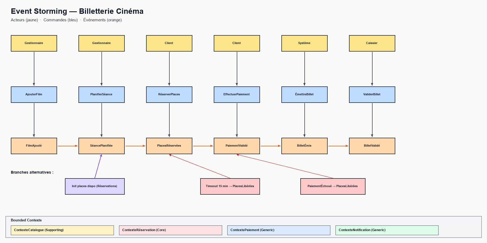

# Event Storming — Billetterie Cinéma

> Chapitre 1 — Livrable 2 : Cartographie des événements, commandes et acteurs du flux principal.
> **Image du board** : [`event-storming.png`](event-storming.png)

---

## Légende

| Code couleur | Signification |
|--------------|---------------|
| 🟡 Jaune | **Acteur** (qui déclenche la commande) |
| 🔵 Bleu | **Commande** (intention métier exprimée à l'impératif) |
| 🟠 Orange | **Événement de domaine** (fait métier au passé) |
| 🟣 Violet | **Conséquence d'un événement** (réaction d'un autre BC) |
| 🔴 Rouge | **Branche alternative** (timeout, échec) |

---

## Événements métier (≥10 requis)

| # | Événement | Description | Acteur déclencheur |
|---|-----------|-------------|--------------------|
| 1 | **FilmAjouté** | Un nouveau film entre au catalogue | Gestionnaire |
| 2 | **SéancePlanifiée** | Une séance est créée dans une salle, à un horaire, avec un tarif | Gestionnaire |
| 3 | **PlacesRéservées** | Le client a sélectionné et bloqué N places | Client |
| 4 | **PaiementRequis** | La réservation EN_ATTENTE déclenche une demande de paiement | Système |
| 5 | **PaiementValidé** | Stripe a confirmé le débit de la carte | Système Stripe |
| 6 | **PaiementÉchoué** | La carte est refusée ou la transaction expire | Système Stripe |
| 7 | **RéservationConfirmée** | La réservation est officiellement validée (post-paiement) | Système |
| 8 | **BilletÉmis** | Un billet électronique avec QR code est généré | Système |
| 9 | **BilletValidé** | Le QR code est scanné à l'entrée de la salle | Caissier |
| 10 | **PlacesLibérées** | Les places sont rendues disponibles (timeout ou annulation) | Système |
| 11 | **RéservationAnnulée** | Le client (ou le système) annule la réservation | Client / Système |
| 12 | **RemboursementEffectué** | Un remboursement est traité après annulation éligible | Système |

---

## Commandes (≥5 requis)

| # | Commande | Description | Acteur émetteur |
|---|----------|-------------|------------------|
| 1 | **AjouterFilm** | Saisir un nouveau film au catalogue | Gestionnaire |
| 2 | **PlanifierSéance** | Créer une séance pour un film, une salle, un horaire | Gestionnaire |
| 3 | **RéserverPlaces** | Bloquer des places pour une séance | Client / Caissier |
| 4 | **EffectuerPaiement** | Procéder au paiement de la réservation | Client |
| 5 | **AnnulerRéservation** | Annuler une réservation en cours ou confirmée | Client |
| 6 | **ValiderBillet** | Scanner le QR code et autoriser l'accès | Caissier |
| 7 | **ÉmettreBillet** | Générer un billet électronique avec QR code | Système |

---

## Acteurs identifiés

- **Client** — réserve, paie, annule, présente son QR code
- **Caissier** — vend en guichet, valide les billets à l'entrée
- **Gestionnaire** — programme les films et les séances, suit la performance
- **Système** — automatismes : timeouts, génération de billets, notifications, expirations
- **Système Stripe** — acteur externe : valide / refuse / rembourse les paiements

---

## Flux principal (résumé)

1. **Gestionnaire** ─*PlanifierSéance*─▶ `SéancePlanifiée`
2. **Client** ─*RéserverPlaces*─▶ `PlacesRéservées`
3. **Système** ─*EffectuerPaiement*─▶ `PaiementValidé`
4. **Système** ─*ÉmettreBillet*─▶ `BilletÉmis` (RéservationConfirmée)
5. **Caissier** ─*ValiderBillet*─▶ `BilletValidé`

## Branches alternatives (sad paths)

- **Timeout 15 min** : `PlacesRéservées` sans paiement → `PlacesLibérées` + `RéservationAnnulée`
- **Paiement refusé** : `PaiementÉchoué` → `PlacesLibérées` + notification client
- **Annulation client** : `RéservationAnnulée` → `RemboursementEffectué` (si éligible)
